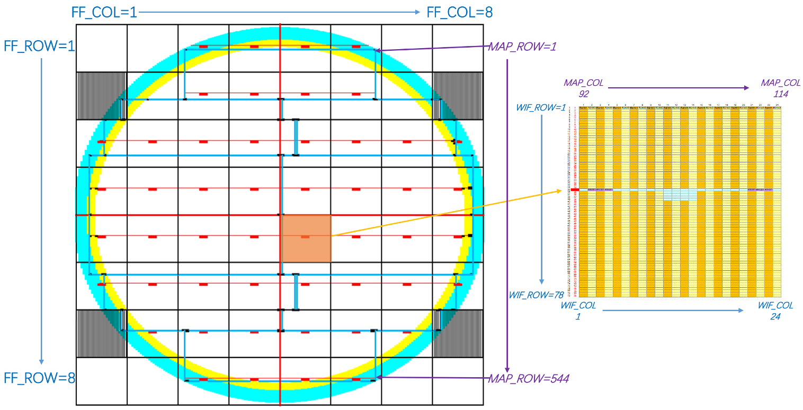
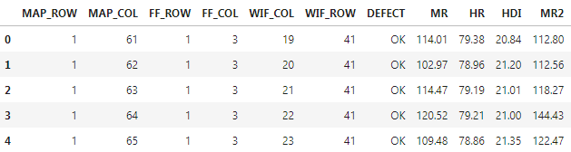

# Data Preparation

This chapter will guide you through the preparation of wafer data. You will get an overview of the data format used in `wfmap`, learn the wafer mapping definition in detail and how to merge it with other data source.

## Definition

Wafer mapping definition used in this package is showed in follwing table, which might be slightly different as the terminology in your industry.  

| Parameter |                               Definition                                | Data Type |
|:---------:|:-----------------------------------------------------------------------:|:---------:|
|  MAP_ROW  |         `y`:  vertical coordinate of the die in the wafermap            |  Integer  |
|  MAP_COL  |         `x`:  horizontal coordinate of the die in the wafermap          |  Integer  |
|  FF_ROW   |         `yn`: vertical coordinate of flash field                        |  Integer  |
|  FF_COL   |         `xn`: horizontal coordinate of flash field                      |  Integer  |
|  WIF_ROW  |     vertical coordinate of the die in the corresponding flash field     |  Integer  |
|  WIF_COL  |    horizontal coordinate of the die in the corresponding flash field    |  Integer  |
| FF_SHAPE  |      (max(FF_ROW),max(FF_COL)): Total Flash Fields by FF Row&Col        |   Tuple   |
|  FF_SIZE  | (max(WIF_ROW),max(WIF_COL)): Total Dies in a Flash Field by Die Row&Col |   Tuple   |

> `FF` is short for `FlashField`, `WIF` stands for `Within FlashField`.

!!! warning
    First two parameters are required in wafer heatmap related plots and succedent 4 parameters are need for trends charts related plots. So please make sure that you have either transformed your data in similar format or pass the correct parameters to corresponding functions.


Below is an illustration for above definition.




## Sample Data

Sample data is shipped within this packages, you can load it as following snippet:

```python
from wfmap.data import load_data
data=load_data()
```

Besides the first 6 columns which define the wafer mapping information, additional 1 categorical feature `DEFECT` & 4 numerial features(`MR`,`HR`,`HDI`,`MR2`) are included for demostration. 

```python
data.head()
```




## Merge Other Data

In most common scenario, wafer data from other source is processed and stored separately by unique DeviceID such as `OCR`, rather than wafer data `MAP_ROW` & `MAP_COL`. Since wafer map definition is not included, You'll need to merge it with wafer map data manually. In my practice, I saved the wafer mapping data as `pickle` file by different wafer type in advance. Then can load it from local directory, no need to read corresponding wafer data from file server or database. 

Here's a sample snippets for your reference, which enable to merge the wafer map data from either local `pickle` file or extract it from wafer incoming data.

```python
from wfdata import Wafer # Load for Wafer Incoming Data
def merge_wfmap(df, ocr_col='SLIDER_OCR_NO', mode='AUTO', join='outer', inc_data=False, map_dir='D:\MAP_DATA'):
    """
    `SLIDER_OCR_NO` = `Wafer` + `OCR`
    """
    assert mode in ['AUTO', 'UP', 'UP2', 'UP3', 'UP2S',
                    'UP3S'], print('Wafer Format Not Suppported!!')
    assert join in ['inner', 'outer'], print('Merge Method Not Suppported!!')

    df['Wafer'] = df[ocr_col].map(lambda x: x[:5])
    df['OCR'] = df[ocr_col].map(lambda x: x[-5:])
    df.set_index('OCR', inplace=True)
    result = []
    for wf, dff in df.groupby('Wafer'):
        if mode == 'AUTO':
            if inc_data:
                map_data = Wafer("H"+wf).inc_data()
            else:
                map_data = Wafer("H"+wf).map_data()
        else:
            map_data = pd.read_pickle(f'{map_dir}/{mode}')
        merged = pd.merge(map_data, dff, right_index=True,
                          left_index=True, how=join)
        merged = merged.drop_duplicates(subset=['MAP_ROW', 'MAP_COL'])
        result.append(merged)
    return pd.concat(result)
```