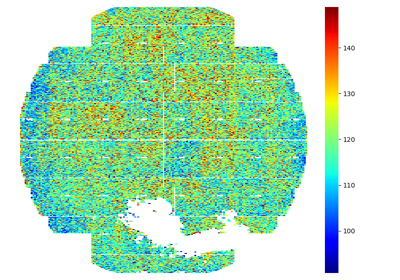
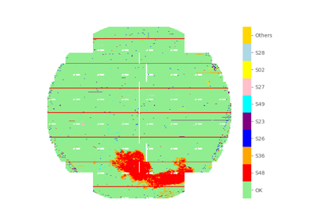
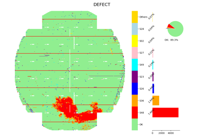
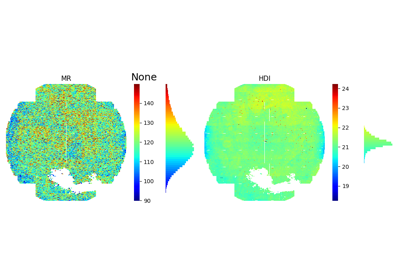
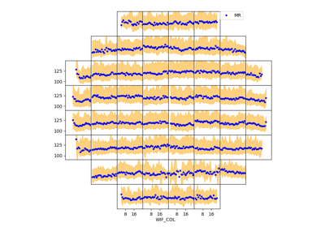
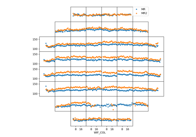
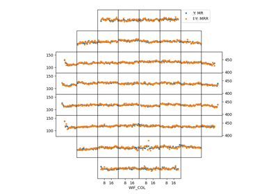

<!-- docs_generated_gallery -->

## Started

    <!--div class="figure align-default" id="id1"-->
        
        

            
                <a class="reference internal" href="plot_0_nheatmap">
                    NumHeatmap
                </a>
            
            <!--a class="headerlink" href="#id1" title="Permalink to this image"></a-->
        

    <!--/div-->

    <!--div class="figure align-default" id="id1"-->
        
        

            
                <a class="reference internal" href="plot_1_cheatmap">
                    CatHeatmap
                </a>
            
            <!--a class="headerlink" href="#id1" title="Permalink to this image"></a-->
        

    <!--/div-->

    <!--div class="figure align-default" id="id1"-->
        
        

            
                <a class="reference internal" href="plot_2_wafermap">
                    WaferMap
                </a>
            
            <!--a class="headerlink" href="#id1" title="Permalink to this image"></a-->
        

    <!--/div-->

    <!--div class="figure align-default" id="id1"-->
        
        

            
                <a class="reference internal" href="plot_3_defectmap">
                    DefectMap
                </a>
            
            <!--a class="headerlink" href="#id1" title="Permalink to this image"></a-->
        

    <!--/div-->

    <!--div class="figure align-default" id="id1"-->
        
        

            
                <a class="reference internal" href="plot_4_incmap">
                    IncomingMap
                </a>
            
            <!--a class="headerlink" href="#id1" title="Permalink to this image"></a-->
        

    <!--/div-->

    <!--div class="figure align-default" id="id1"-->
        
        

            
                <a class="reference internal" href="plot_5_wif_trend">
                    WIF Trend
                </a>
            
            <!--a class="headerlink" href="#id1" title="Permalink to this image"></a-->
        

    <!--/div-->

    <!--div class="figure align-default" id="id1"-->
        
        

            
                <a class="reference internal" href="plot_6_wif_trends">
                    WIF Trends
                </a>
            
            <!--a class="headerlink" href="#id1" title="Permalink to this image"></a-->
        

    <!--/div-->

    <!--div class="figure align-default" id="id1"-->
        
        

            
                <a class="reference internal" href="plot_7_twin_trends">
                    TwinY Trends
                </a>
            
            <!--a class="headerlink" href="#id1" title="Permalink to this image"></a-->
        

    <!--/div-->

[:fontawesome-solid-download: Download all examples in Python source code: gallery_python.zip](./gallery_python.zip){ .md-button .center}

[:fontawesome-solid-download: Download all examples in Jupyter notebooks: gallery_jupyter.zip](./gallery_jupyter.zip){ .md-button .center}

[Gallery generated by mkdocs-gallery](https://mkdocs-gallery.github.io){: .mkd-glr-signature }
