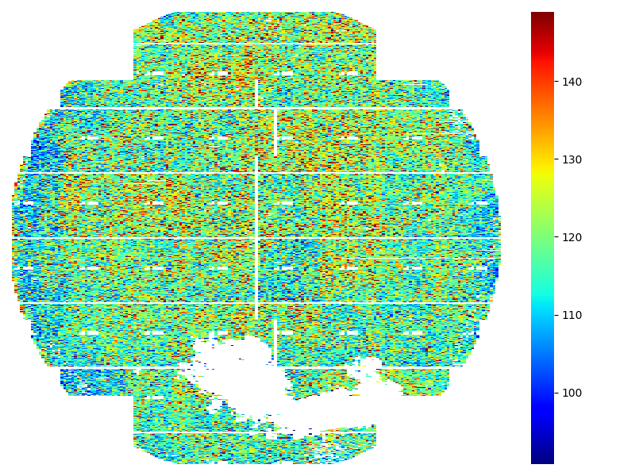

<!--
 DO NOT EDIT.
 THIS FILE WAS AUTOMATICALLY GENERATED BY mkdocs-gallery.
 TO MAKE CHANGES, EDIT THE SOURCE PYTHON FILE:
 "docs/examples/plot_0_nheatmap.py"
 LINE NUMBERS ARE GIVEN BELOW.
-->

!!! note

    Click [here](#download_links)
    to download the full example code


Numerical Heatmap `num_heatmap`
=================================
> WaferMap for Numerical Variable

`num_heatmap` uses the colormap `jet` which present high value with hot color(red) and low value with cold value(blue). This example demonstrates how to use the sample data to create simple WaferMap at ease.  `MAP_ROW` & `MAP_COL` are the default value for wafer `row` & `col`, need be replaced if it's different from your data.

<!-- GENERATED FROM PYTHON SOURCE LINES 9-20 -->

```{.python }

import numpy as np
from wfmap.data import load_data
from wfmap import num_heatmap
import matplotlib.pyplot as plt

data = load_data()
ax = num_heatmap(data, 'MR')
plt.tight_layout()


```


{: .mkd-glr-single-img srcset="../images/mkd_glr_plot_0_nheatmap_001.png"}


<!-- GENERATED FROM PYTHON SOURCE LINES 21-22 -->

Usually, the range of colorbar is auto inferred by majority of center population, which suggests the range might not be consistent for the same parameter by different wafers. If you want to have more subtle colorbar control, you can provide the est.sigma of value `vsigma` or value range `vrange` to keep the colorbar to have a fixed range.

<!-- GENERATED FROM PYTHON SOURCE LINES 22-39 -->

```{.python }


def auto_vlim(series, majority=94, n_sigma=3, vsigma=None, vrange=None):
    """
    Infer the best range of a series for plotting
    """
    low, high = np.percentile(series.dropna(), [50-majority/2, 50+majority/2])
    centers = series.where((series >= low) & (series <= high), np.nan)
    if vsigma == None:
        vsigma = centers.std()
    if vrange:
        vmin = (low+high-vrange)/2
        vmax = (low+high+vrange)/2
    else:
        vmax = centers.mean()+n_sigma*vsigma
        vmin = centers.mean()-n_sigma*vsigma
    return vmin, vmax
```


**Total running time of the script:** ( 0 minutes  0.210 seconds)

<div id="download_links"></div>


[:fontawesome-solid-download: Download Python source code: plot_0_nheatmap.py](./plot_0_nheatmap.py){ .md-button .center}

[:fontawesome-solid-download: Download Jupyter notebook: plot_0_nheatmap.ipynb](./plot_0_nheatmap.ipynb){ .md-button .center}


[Gallery generated by mkdocs-gallery](https://mkdocs-gallery.github.io){: .mkd-glr-signature }
