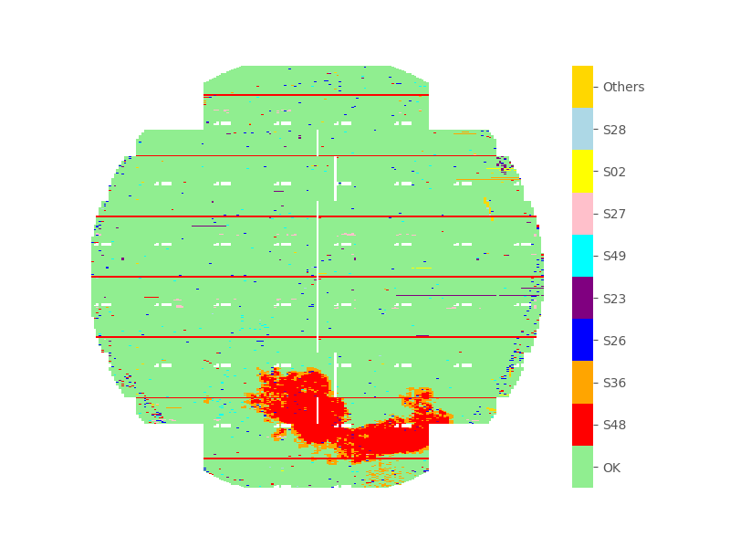

<!--
 DO NOT EDIT.
 THIS FILE WAS AUTOMATICALLY GENERATED BY mkdocs-gallery.
 TO MAKE CHANGES, EDIT THE SOURCE PYTHON FILE:
 "docs/examples/plot_1_cheatmap.py"
 LINE NUMBERS ARE GIVEN BELOW.
-->

!!! note

    Click [here](#download_links)
    to download the full example code


Categorical Heatmap `cat_heatmap`
=================================
> WaferMap for Categorical Variable

`cat_heatmap` is essentially a variant of `num_heatmap`. Internally, the categorical variable is  first transformed to integers according to the rank of each unique count. And then plot the heatmap using the intermediate numbers.

Below example demonstrates the simplest case of creating a categorical heatmap. You can have more customization by providing `code_dict` if you want to have some transformation before the plotting, eg. merge some items or change perticular item name. You can also set the `qty_limit` to control the max items will be presented in the plot, categories which are beyond the `qty_limit` will be counted together as `Others`.

<!-- GENERATED FROM PYTHON SOURCE LINES 11-17 -->


{: .mkd-glr-single-img srcset="../images/mkd_glr_plot_1_cheatmap_001.png"}

Out:
{: .mkd-glr-script-out }

```{.shell .mkd-glr-script-out-disp }
E:\zwPython\py37\python-3.7.4.amd64\lib\site-packages\win32\lib\pywintypes.py:2: DeprecationWarning: the imp module is deprecated in favour of importlib; see the module's documentation for alternative uses
  import imp, sys, os
E:\zwPython\py37\python-3.7.4.amd64\lib\site-packages\sphinx\util\rst.py:58: DeprecationWarning: 'environmentfilter' is renamed to 'pass_environment', the old name will be removed in Jinja 3.1.
  def heading(env: Environment, text: str, level: int = 1) -> str:
E:\zwPython\py37\python-3.7.4.amd64\lib\site-packages\seaborn\matrix.py:70: DeprecationWarning: `np.bool` is a deprecated alias for the builtin `bool`. To silence this warning, use `bool` by itself. Doing this will not modify any behavior and is safe. If you specifically wanted the numpy scalar type, use `np.bool_` here.
Deprecated in NumPy 1.20; for more details and guidance: https://numpy.org/devdocs/release/1.20.0-notes.html#deprecations
  mask = np.zeros(data.shape, np.bool)

```


<br />

```{.python }

from wfmap.data import load_data
from wfmap import cat_heatmap

data = load_data()
fig = cat_heatmap(data, 'DEFECT')
```


**Total running time of the script:** ( 0 minutes  36.984 seconds)

<div id="download_links"></div>


[:fontawesome-solid-download: Download Python source code: plot_1_cheatmap.py](./plot_1_cheatmap.py){ .md-button .center}

[:fontawesome-solid-download: Download Jupyter notebook: plot_1_cheatmap.ipynb](./plot_1_cheatmap.ipynb){ .md-button .center}


[Gallery generated by mkdocs-gallery](https://mkdocs-gallery.github.io){: .mkd-glr-signature }
