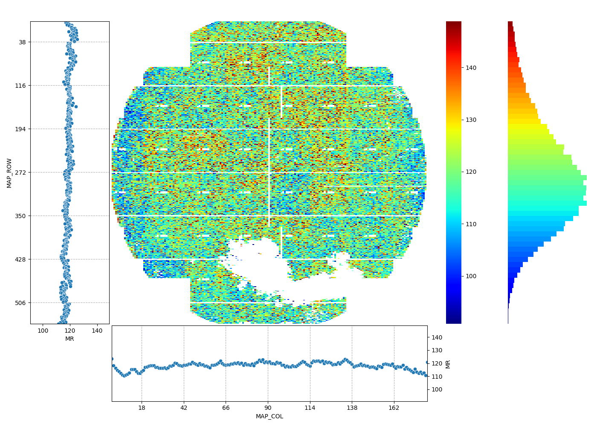

<!--
 DO NOT EDIT.
 THIS FILE WAS AUTOMATICALLY GENERATED BY mkdocs-gallery.
 TO MAKE CHANGES, EDIT THE SOURCE PYTHON FILE:
 "docs/examples/plot_2_wafermap.py"
 LINE NUMBERS ARE GIVEN BELOW.
-->

!!! note

    Click [here](#download_links)
    to download the full example code


WaferMap `wafermap`
=================================
> WaferMap with Distribution & Median Trend Subplots

WaferMap add additional color distribution plot and trend charts by row/col around basic NumHeatmap.Color distribution plot shares the same limit as colorbar from heatmap. And vertical and horizonal trend charts is only diplayed when `wftype` is provided, since the grid line are using the pre-defined flash field boundary by `wftype`.

<!-- GENERATED FROM PYTHON SOURCE LINES 9-15 -->


{: .mkd-glr-single-img srcset="../images/mkd_glr_plot_2_wafermap_001.png"}

Out:
{: .mkd-glr-script-out }

```{.shell .mkd-glr-script-out-disp }
E:\zwPython\py37\python-3.7.4.amd64\lib\site-packages\seaborn\matrix.py:70: DeprecationWarning: `np.bool` is a deprecated alias for the builtin `bool`. To silence this warning, use `bool` by itself. Doing this will not modify any behavior and is safe. If you specifically wanted the numpy scalar type, use `np.bool_` here.
Deprecated in NumPy 1.20; for more details and guidance: https://numpy.org/devdocs/release/1.20.0-notes.html#deprecations
  mask = np.zeros(data.shape, np.bool)

```


<br />

```{.python }

from wfmap.data import load_data
from wfmap import wafermap

data = load_data()
fig = wafermap(data, 'MR', wftype='UP3')
```


**Total running time of the script:** ( 0 minutes  0.969 seconds)

<div id="download_links"></div>


[:fontawesome-solid-download: Download Python source code: plot_2_wafermap.py](./plot_2_wafermap.py){ .md-button .center}

[:fontawesome-solid-download: Download Jupyter notebook: plot_2_wafermap.ipynb](./plot_2_wafermap.ipynb){ .md-button .center}


[Gallery generated by mkdocs-gallery](https://mkdocs-gallery.github.io){: .mkd-glr-signature }
