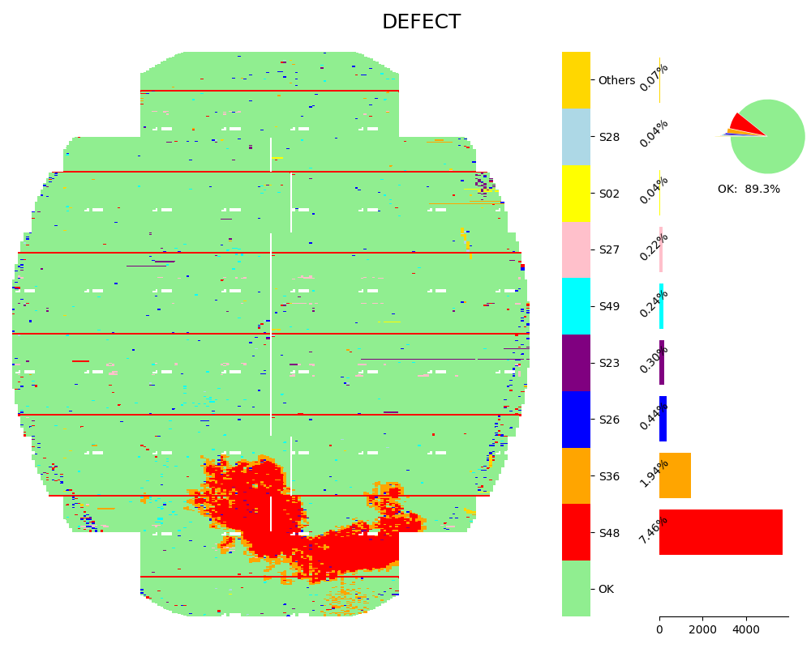

<!--
 DO NOT EDIT.
 THIS FILE WAS AUTOMATICALLY GENERATED BY mkdocs-gallery.
 TO MAKE CHANGES, EDIT THE SOURCE PYTHON FILE:
 "docs/examples/plot_3_defectmap.py"
 LINE NUMBERS ARE GIVEN BELOW.
-->

!!! note

    Click [here](#download_links)
    to download the full example code or to run this example in your browser via Binder


DefectMap
=================================
> Wafer DefectMap with Pareto Subplot

This example demonstrates how to import a local module and how images are
stacked when two plots are created in one code block. The variable ``N`` from
the example 'Local module' (file ``local_module.py``) is imported in the code
below. Further, note that when there is only one code block in an example, the
output appears before the code block.

<!-- GENERATED FROM PYTHON SOURCE LINES 12-18 -->


{: .mkd-glr-single-img srcset="/generated/gallery/images/mkd_glr_plot_3_defectmap_001.png, /generated/gallery/images/mkd_glr_plot_3_defectmap_001_2_0x.png 2.0x"}

Out:
{: .mkd-glr-script-out }

```{.shell .mkd-glr-script-out-disp }
/Users/xlhaw/opt/anaconda3/lib/python3.7/site-packages/wfmap-1.0.2.dev0-py3.7.egg/wfmap/__init__.py:319: UserWarning: This figure includes Axes that are not compatible with tight_layout, so results might be incorrect.

```


<br />

```{.python }

from wfmap.data import load_data
from wfmap import defectmap

data = load_data()
fig = defectmap(data, 'DEFECT')
```


**Total running time of the script:** ( 0 minutes  1.998 seconds)

<div id="download_links"></div>

[](https://mybinder.org/v2/gh/smarie/mkdocs-gallery/gh-pages?urlpath=lab/tree/notebooks/generated/gallery/plot_3_defectmap.ipynb){ .center}

[:fontawesome-solid-download: Download Python source code: plot_3_defectmap.py](./plot_3_defectmap.py){ .md-button .center}

[:fontawesome-solid-download: Download Jupyter notebook: plot_3_defectmap.ipynb](./plot_3_defectmap.ipynb){ .md-button .center}


[Gallery generated by mkdocs-gallery](https://mkdocs-gallery.github.io){: .mkd-glr-signature }
