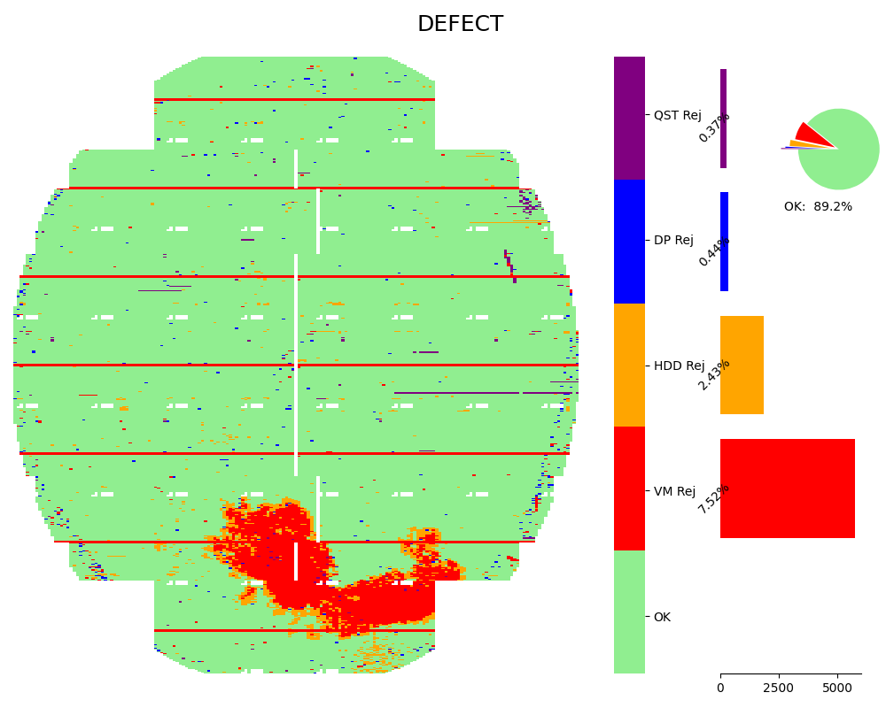

<!--
 DO NOT EDIT.
 THIS FILE WAS AUTOMATICALLY GENERATED BY mkdocs-gallery.
 TO MAKE CHANGES, EDIT THE SOURCE PYTHON FILE:
 "docs/examples/plot_3_defectmap.py"
 LINE NUMBERS ARE GIVEN BELOW.
-->

!!! note

    Click [here](#download_links)
    to download the full example code


DefectMap `defectmap`
=================================
> Wafer DefectMap with Pareto Subplot

DefectMap is aimed for defect analysis, beside the defect distribution by `cat_heatmap`, yield summary and top defect statistics are also applied by using inset pie chart and bar chart subplot.

Unlike in the `cat_heatmap`, categories are ordered by unique count in default. `defectmap` use the 'OK' as the top category and set it with `lightgreen` color. You can UAI other codes eg. 'BINA','BINB' as `OK` by update the `ok_codes`.

<!-- GENERATED FROM PYTHON SOURCE LINES 11-19 -->

```{.python }

import random
from wfmap.data import load_data
from wfmap import defectmap

data = load_data()
fig = defectmap(data, 'DEFECT')

```


{: .mkd-glr-single-img srcset="../images/mkd_glr_plot_3_defectmap_001.png"}

Out:
{: .mkd-glr-script-out }

```{.shell .mkd-glr-script-out-disp }
/Users/xlhaw/opt/anaconda3/envs/py39a/lib/python3.9/site-packages/wfmap-1.0.4-py3.9.egg/wfmap/__init__.py:209: FutureWarning: The series.append method is deprecated and will be removed from pandas in a future version. Use pandas.concat instead.

```


<!-- GENERATED FROM PYTHON SOURCE LINES 20-21 -->

Above example used the default defect code from sample data, you change it to more reader-friendly and meaningful remark by modify the `code_dict` as below.

<!-- GENERATED FROM PYTHON SOURCE LINES 21-29 -->

```{.python }

code_dict = {}
for code in data['DEFECT'].unique():
    if code.startswith('S'):
        code_dict[code] = random.choice(
            ['QST Rej', 'HDD Rej', 'DP Rej', 'VM Rej'])

fig2 = defectmap(data, 'DEFECT', code_dict=code_dict)
```


{: .mkd-glr-single-img srcset="../images/mkd_glr_plot_3_defectmap_002.png"}


**Total running time of the script:** ( 0 minutes  0.526 seconds)

<div id="download_links"></div>


[:fontawesome-solid-download: Download Python source code: plot_3_defectmap.py](./plot_3_defectmap.py){ .md-button .center}

[:fontawesome-solid-download: Download Jupyter notebook: plot_3_defectmap.ipynb](./plot_3_defectmap.ipynb){ .md-button .center}


[Gallery generated by mkdocs-gallery](https://mkdocs-gallery.github.io){: .mkd-glr-signature }
