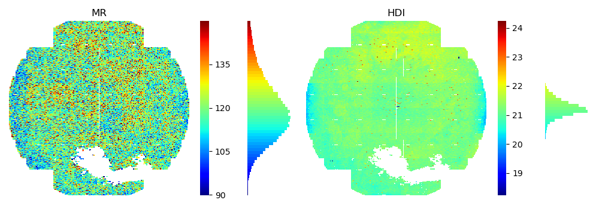

<!--
 DO NOT EDIT.
 THIS FILE WAS AUTOMATICALLY GENERATED BY mkdocs-gallery.
 TO MAKE CHANGES, EDIT THE SOURCE PYTHON FILE:
 "docs/examples/plot_4_incmap.py"
 LINE NUMBERS ARE GIVEN BELOW.
-->

!!! note

    Click [here](#download_links)
    to download the full example code


IncomingMap 
=================================
> Combined WaferMap for Wafer Incoming Data

IncomingMap is an horizontal concatenation of multiple WaferMap for wafer incoming data. `vsigmas` is a `dict` which collects the estimated value sigma for heatmap/colorbar range determination. Items which only lists in the `vsigmas` will be plotted. You can adjust the `vsigmas` &  `title` to customize your own wafermap combination.

Below is a simple IncomingMap which contains two variables `MR` & `HDI` only.

<!-- GENERATED FROM PYTHON SOURCE LINES 11-17 -->


{: .mkd-glr-single-img srcset="../images/mkd_glr_plot_4_incmap_001.png"}


```{.python }

from wfmap.data import load_data
from wfmap import create_incmap

data = load_data()
fig = create_incmap(data, vsigmas={'MR': 10, 'HDI': 1})
```


**Total running time of the script:** ( 0 minutes  0.363 seconds)

<div id="download_links"></div>


[:fontawesome-solid-download: Download Python source code: plot_4_incmap.py](./plot_4_incmap.py){ .md-button .center}

[:fontawesome-solid-download: Download Jupyter notebook: plot_4_incmap.ipynb](./plot_4_incmap.ipynb){ .md-button .center}


[Gallery generated by mkdocs-gallery](https://mkdocs-gallery.github.io){: .mkd-glr-signature }
