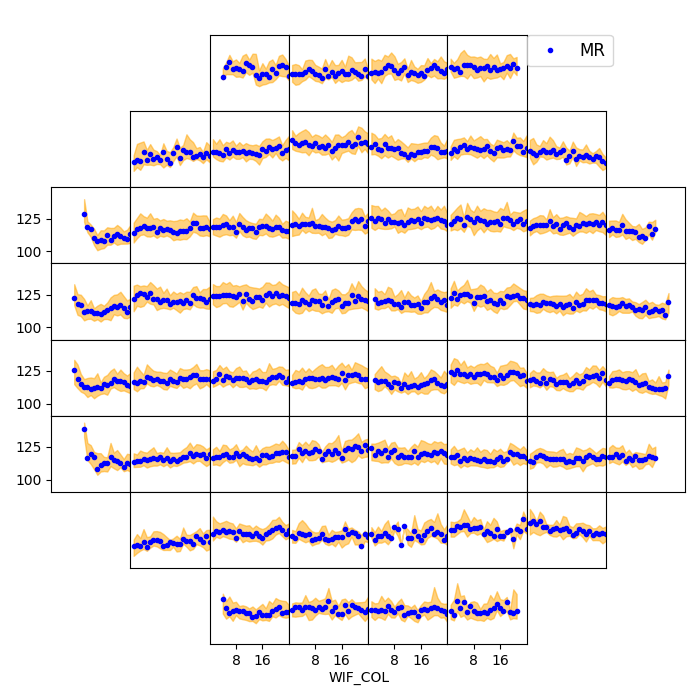

<!--
 DO NOT EDIT.
 THIS FILE WAS AUTOMATICALLY GENERATED BY mkdocs-gallery.
 TO MAKE CHANGES, EDIT THE SOURCE PYTHON FILE:
 "docs/examples/plot_5_wif_trend.py"
 LINE NUMBERS ARE GIVEN BELOW.
-->

!!! note

    Click [here](#download_links)
    to download the full example code

WIF Trend `wif_trend`
=================================

> Wafer Trend Charts by Flash Field For Single Variable

WIF Trend gives you a clear view of within flash field & field to field tendency and distribution. Anormal waving or mountain shape pattern and shot-jump pattern could be easily spotted with this chart.
Blue line is median trend by default which is less impacted by outliers, and orange area indicates the major distribution at the same `WIF_COL`.

<!-- GENERATED FROM PYTHON SOURCE LINES 10-17 -->

```{.python
from wfmap.data import load_data
from wfmap import wif_trend

data = load_data()
fig = wif_trend(data, 'MR')
```

{: .mkd-glr-single-img srcset="../images/mkd_glr_plot_5_wif_trend_001.png"}

<!-- GENERATED FROM PYTHON SOURCE LINES 18-19 -->

The size of orange area is determined by `majority`, which means the center percentage of the whole distribution. To achieve similar quantile as boxplot could set `majority=50`.

<!-- GENERATED FROM PYTHON SOURCE LINES 19-22 -->

```{.python
fig2 = wif_trend(data, 'MR', majority=50)
```

```{.pytb
Traceback (most recent call last):
  File "F:/wfmap/docs/examples/plot_5_wif_trend.py", line 21, in <module>
    fig2 = wif_trend(data, 'MR', majority=50)
TypeError: wif_trend() got an unexpected keyword argument 'majority'
```

**Total running time of the script:** ( 0 minutes  3.888 seconds)

<div id="download_links"></div>

[:fontawesome-solid-download: Download Python source code: plot_5_wif_trend.py](./plot_5_wif_trend.py){ .md-button .center}

[:fontawesome-solid-download: Download Jupyter notebook: plot_5_wif_trend.ipynb](./plot_5_wif_trend.ipynb){ .md-button .center}

[Gallery generated by mkdocs-gallery](https://mkdocs-gallery.github.io){: .mkd-glr-signature }
