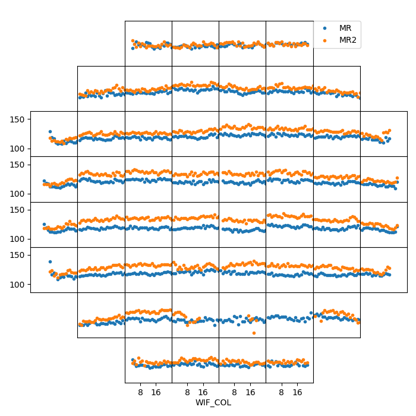

<!--
 DO NOT EDIT.
 THIS FILE WAS AUTOMATICALLY GENERATED BY mkdocs-gallery.
 TO MAKE CHANGES, EDIT THE SOURCE PYTHON FILE:
 "docs/examples/plot_6_wif_trends.py"
 LINE NUMBERS ARE GIVEN BELOW.
-->

!!! note

    Click [here](#download_links)
    to download the full example code or to run this example in your browser via Binder


WIF Trends
=================================
> Wafer Trend Charts by Flash Field For Multiple Variables within Similar Range

This example demonstrates how to import a local module and how images are
stacked when two plots are created in one code block. The variable ``N`` from
the example 'Local module' (file ``local_module.py``) is imported in the code
below. Further, note that when there is only one code block in an example, the
output appears before the code block.

<!-- GENERATED FROM PYTHON SOURCE LINES 12-18 -->


{: .mkd-glr-single-img srcset="/generated/gallery/images/mkd_glr_plot_6_wif_trends_001.png, /generated/gallery/images/mkd_glr_plot_6_wif_trends_001_2_0x.png 2.0x"}

Out:
{: .mkd-glr-script-out }

```{.shell .mkd-glr-script-out-disp }
/Users/xlhaw/opt/anaconda3/lib/python3.7/site-packages/wfmap-1.0.2.dev0-py3.7.egg/wfmap/__init__.py:343: MatplotlibDeprecationWarning: Adding an axes using the same arguments as a previous axes currently reuses the earlier instance.  In a future version, a new instance will always be created and returned.  Meanwhile, this warning can be suppressed, and the future behavior ensured, by passing a unique label to each axes instance.
/Users/xlhaw/opt/anaconda3/lib/python3.7/site-packages/wfmap-1.0.2.dev0-py3.7.egg/wfmap/__init__.py:343: MatplotlibDeprecationWarning: Adding an axes using the same arguments as a previous axes currently reuses the earlier instance.  In a future version, a new instance will always be created and returned.  Meanwhile, this warning can be suppressed, and the future behavior ensured, by passing a unique label to each axes instance.
/Users/xlhaw/opt/anaconda3/lib/python3.7/site-packages/wfmap-1.0.2.dev0-py3.7.egg/wfmap/__init__.py:343: MatplotlibDeprecationWarning: Adding an axes using the same arguments as a previous axes currently reuses the earlier instance.  In a future version, a new instance will always be created and returned.  Meanwhile, this warning can be suppressed, and the future behavior ensured, by passing a unique label to each axes instance.
/Users/xlhaw/opt/anaconda3/lib/python3.7/site-packages/wfmap-1.0.2.dev0-py3.7.egg/wfmap/__init__.py:343: MatplotlibDeprecationWarning: Adding an axes using the same arguments as a previous axes currently reuses the earlier instance.  In a future version, a new instance will always be created and returned.  Meanwhile, this warning can be suppressed, and the future behavior ensured, by passing a unique label to each axes instance.
/Users/xlhaw/opt/anaconda3/lib/python3.7/site-packages/wfmap-1.0.2.dev0-py3.7.egg/wfmap/__init__.py:343: MatplotlibDeprecationWarning: Adding an axes using the same arguments as a previous axes currently reuses the earlier instance.  In a future version, a new instance will always be created and returned.  Meanwhile, this warning can be suppressed, and the future behavior ensured, by passing a unique label to each axes instance.
/Users/xlhaw/opt/anaconda3/lib/python3.7/site-packages/wfmap-1.0.2.dev0-py3.7.egg/wfmap/__init__.py:343: MatplotlibDeprecationWarning: Adding an axes using the same arguments as a previous axes currently reuses the earlier instance.  In a future version, a new instance will always be created and returned.  Meanwhile, this warning can be suppressed, and the future behavior ensured, by passing a unique label to each axes instance.
/Users/xlhaw/opt/anaconda3/lib/python3.7/site-packages/wfmap-1.0.2.dev0-py3.7.egg/wfmap/__init__.py:343: MatplotlibDeprecationWarning: Adding an axes using the same arguments as a previous axes currently reuses the earlier instance.  In a future version, a new instance will always be created and returned.  Meanwhile, this warning can be suppressed, and the future behavior ensured, by passing a unique label to each axes instance.
/Users/xlhaw/opt/anaconda3/lib/python3.7/site-packages/wfmap-1.0.2.dev0-py3.7.egg/wfmap/__init__.py:343: MatplotlibDeprecationWarning: Adding an axes using the same arguments as a previous axes currently reuses the earlier instance.  In a future version, a new instance will always be created and returned.  Meanwhile, this warning can be suppressed, and the future behavior ensured, by passing a unique label to each axes instance.
/Users/xlhaw/opt/anaconda3/lib/python3.7/site-packages/wfmap-1.0.2.dev0-py3.7.egg/wfmap/__init__.py:343: MatplotlibDeprecationWarning: Adding an axes using the same arguments as a previous axes currently reuses the earlier instance.  In a future version, a new instance will always be created and returned.  Meanwhile, this warning can be suppressed, and the future behavior ensured, by passing a unique label to each axes instance.
/Users/xlhaw/opt/anaconda3/lib/python3.7/site-packages/wfmap-1.0.2.dev0-py3.7.egg/wfmap/__init__.py:343: MatplotlibDeprecationWarning: Adding an axes using the same arguments as a previous axes currently reuses the earlier instance.  In a future version, a new instance will always be created and returned.  Meanwhile, this warning can be suppressed, and the future behavior ensured, by passing a unique label to each axes instance.
/Users/xlhaw/opt/anaconda3/lib/python3.7/site-packages/wfmap-1.0.2.dev0-py3.7.egg/wfmap/__init__.py:343: MatplotlibDeprecationWarning: Adding an axes using the same arguments as a previous axes currently reuses the earlier instance.  In a future version, a new instance will always be created and returned.  Meanwhile, this warning can be suppressed, and the future behavior ensured, by passing a unique label to each axes instance.
/Users/xlhaw/opt/anaconda3/lib/python3.7/site-packages/wfmap-1.0.2.dev0-py3.7.egg/wfmap/__init__.py:343: MatplotlibDeprecationWarning: Adding an axes using the same arguments as a previous axes currently reuses the earlier instance.  In a future version, a new instance will always be created and returned.  Meanwhile, this warning can be suppressed, and the future behavior ensured, by passing a unique label to each axes instance.
/Users/xlhaw/opt/anaconda3/lib/python3.7/site-packages/wfmap-1.0.2.dev0-py3.7.egg/wfmap/__init__.py:343: MatplotlibDeprecationWarning: Adding an axes using the same arguments as a previous axes currently reuses the earlier instance.  In a future version, a new instance will always be created and returned.  Meanwhile, this warning can be suppressed, and the future behavior ensured, by passing a unique label to each axes instance.
/Users/xlhaw/opt/anaconda3/lib/python3.7/site-packages/wfmap-1.0.2.dev0-py3.7.egg/wfmap/__init__.py:343: MatplotlibDeprecationWarning: Adding an axes using the same arguments as a previous axes currently reuses the earlier instance.  In a future version, a new instance will always be created and returned.  Meanwhile, this warning can be suppressed, and the future behavior ensured, by passing a unique label to each axes instance.
/Users/xlhaw/opt/anaconda3/lib/python3.7/site-packages/wfmap-1.0.2.dev0-py3.7.egg/wfmap/__init__.py:343: MatplotlibDeprecationWarning: Adding an axes using the same arguments as a previous axes currently reuses the earlier instance.  In a future version, a new instance will always be created and returned.  Meanwhile, this warning can be suppressed, and the future behavior ensured, by passing a unique label to each axes instance.
/Users/xlhaw/opt/anaconda3/lib/python3.7/site-packages/wfmap-1.0.2.dev0-py3.7.egg/wfmap/__init__.py:343: MatplotlibDeprecationWarning: Adding an axes using the same arguments as a previous axes currently reuses the earlier instance.  In a future version, a new instance will always be created and returned.  Meanwhile, this warning can be suppressed, and the future behavior ensured, by passing a unique label to each axes instance.
/Users/xlhaw/opt/anaconda3/lib/python3.7/site-packages/wfmap-1.0.2.dev0-py3.7.egg/wfmap/__init__.py:343: MatplotlibDeprecationWarning: Adding an axes using the same arguments as a previous axes currently reuses the earlier instance.  In a future version, a new instance will always be created and returned.  Meanwhile, this warning can be suppressed, and the future behavior ensured, by passing a unique label to each axes instance.
/Users/xlhaw/opt/anaconda3/lib/python3.7/site-packages/wfmap-1.0.2.dev0-py3.7.egg/wfmap/__init__.py:343: MatplotlibDeprecationWarning: Adding an axes using the same arguments as a previous axes currently reuses the earlier instance.  In a future version, a new instance will always be created and returned.  Meanwhile, this warning can be suppressed, and the future behavior ensured, by passing a unique label to each axes instance.
/Users/xlhaw/opt/anaconda3/lib/python3.7/site-packages/wfmap-1.0.2.dev0-py3.7.egg/wfmap/__init__.py:343: MatplotlibDeprecationWarning: Adding an axes using the same arguments as a previous axes currently reuses the earlier instance.  In a future version, a new instance will always be created and returned.  Meanwhile, this warning can be suppressed, and the future behavior ensured, by passing a unique label to each axes instance.
/Users/xlhaw/opt/anaconda3/lib/python3.7/site-packages/wfmap-1.0.2.dev0-py3.7.egg/wfmap/__init__.py:343: MatplotlibDeprecationWarning: Adding an axes using the same arguments as a previous axes currently reuses the earlier instance.  In a future version, a new instance will always be created and returned.  Meanwhile, this warning can be suppressed, and the future behavior ensured, by passing a unique label to each axes instance.
/Users/xlhaw/opt/anaconda3/lib/python3.7/site-packages/wfmap-1.0.2.dev0-py3.7.egg/wfmap/__init__.py:343: MatplotlibDeprecationWarning: Adding an axes using the same arguments as a previous axes currently reuses the earlier instance.  In a future version, a new instance will always be created and returned.  Meanwhile, this warning can be suppressed, and the future behavior ensured, by passing a unique label to each axes instance.
/Users/xlhaw/opt/anaconda3/lib/python3.7/site-packages/wfmap-1.0.2.dev0-py3.7.egg/wfmap/__init__.py:343: MatplotlibDeprecationWarning: Adding an axes using the same arguments as a previous axes currently reuses the earlier instance.  In a future version, a new instance will always be created and returned.  Meanwhile, this warning can be suppressed, and the future behavior ensured, by passing a unique label to each axes instance.
/Users/xlhaw/opt/anaconda3/lib/python3.7/site-packages/wfmap-1.0.2.dev0-py3.7.egg/wfmap/__init__.py:343: MatplotlibDeprecationWarning: Adding an axes using the same arguments as a previous axes currently reuses the earlier instance.  In a future version, a new instance will always be created and returned.  Meanwhile, this warning can be suppressed, and the future behavior ensured, by passing a unique label to each axes instance.
/Users/xlhaw/opt/anaconda3/lib/python3.7/site-packages/wfmap-1.0.2.dev0-py3.7.egg/wfmap/__init__.py:343: MatplotlibDeprecationWarning: Adding an axes using the same arguments as a previous axes currently reuses the earlier instance.  In a future version, a new instance will always be created and returned.  Meanwhile, this warning can be suppressed, and the future behavior ensured, by passing a unique label to each axes instance.
/Users/xlhaw/opt/anaconda3/lib/python3.7/site-packages/wfmap-1.0.2.dev0-py3.7.egg/wfmap/__init__.py:343: MatplotlibDeprecationWarning: Adding an axes using the same arguments as a previous axes currently reuses the earlier instance.  In a future version, a new instance will always be created and returned.  Meanwhile, this warning can be suppressed, and the future behavior ensured, by passing a unique label to each axes instance.
/Users/xlhaw/opt/anaconda3/lib/python3.7/site-packages/wfmap-1.0.2.dev0-py3.7.egg/wfmap/__init__.py:343: MatplotlibDeprecationWarning: Adding an axes using the same arguments as a previous axes currently reuses the earlier instance.  In a future version, a new instance will always be created and returned.  Meanwhile, this warning can be suppressed, and the future behavior ensured, by passing a unique label to each axes instance.
/Users/xlhaw/opt/anaconda3/lib/python3.7/site-packages/wfmap-1.0.2.dev0-py3.7.egg/wfmap/__init__.py:343: MatplotlibDeprecationWarning: Adding an axes using the same arguments as a previous axes currently reuses the earlier instance.  In a future version, a new instance will always be created and returned.  Meanwhile, this warning can be suppressed, and the future behavior ensured, by passing a unique label to each axes instance.
/Users/xlhaw/opt/anaconda3/lib/python3.7/site-packages/wfmap-1.0.2.dev0-py3.7.egg/wfmap/__init__.py:343: MatplotlibDeprecationWarning: Adding an axes using the same arguments as a previous axes currently reuses the earlier instance.  In a future version, a new instance will always be created and returned.  Meanwhile, this warning can be suppressed, and the future behavior ensured, by passing a unique label to each axes instance.
/Users/xlhaw/opt/anaconda3/lib/python3.7/site-packages/wfmap-1.0.2.dev0-py3.7.egg/wfmap/__init__.py:343: MatplotlibDeprecationWarning: Adding an axes using the same arguments as a previous axes currently reuses the earlier instance.  In a future version, a new instance will always be created and returned.  Meanwhile, this warning can be suppressed, and the future behavior ensured, by passing a unique label to each axes instance.
/Users/xlhaw/opt/anaconda3/lib/python3.7/site-packages/wfmap-1.0.2.dev0-py3.7.egg/wfmap/__init__.py:343: MatplotlibDeprecationWarning: Adding an axes using the same arguments as a previous axes currently reuses the earlier instance.  In a future version, a new instance will always be created and returned.  Meanwhile, this warning can be suppressed, and the future behavior ensured, by passing a unique label to each axes instance.
/Users/xlhaw/opt/anaconda3/lib/python3.7/site-packages/wfmap-1.0.2.dev0-py3.7.egg/wfmap/__init__.py:343: MatplotlibDeprecationWarning: Adding an axes using the same arguments as a previous axes currently reuses the earlier instance.  In a future version, a new instance will always be created and returned.  Meanwhile, this warning can be suppressed, and the future behavior ensured, by passing a unique label to each axes instance.
/Users/xlhaw/opt/anaconda3/lib/python3.7/site-packages/wfmap-1.0.2.dev0-py3.7.egg/wfmap/__init__.py:343: MatplotlibDeprecationWarning: Adding an axes using the same arguments as a previous axes currently reuses the earlier instance.  In a future version, a new instance will always be created and returned.  Meanwhile, this warning can be suppressed, and the future behavior ensured, by passing a unique label to each axes instance.
/Users/xlhaw/opt/anaconda3/lib/python3.7/site-packages/wfmap-1.0.2.dev0-py3.7.egg/wfmap/__init__.py:343: MatplotlibDeprecationWarning: Adding an axes using the same arguments as a previous axes currently reuses the earlier instance.  In a future version, a new instance will always be created and returned.  Meanwhile, this warning can be suppressed, and the future behavior ensured, by passing a unique label to each axes instance.
/Users/xlhaw/opt/anaconda3/lib/python3.7/site-packages/wfmap-1.0.2.dev0-py3.7.egg/wfmap/__init__.py:343: MatplotlibDeprecationWarning: Adding an axes using the same arguments as a previous axes currently reuses the earlier instance.  In a future version, a new instance will always be created and returned.  Meanwhile, this warning can be suppressed, and the future behavior ensured, by passing a unique label to each axes instance.
/Users/xlhaw/opt/anaconda3/lib/python3.7/site-packages/wfmap-1.0.2.dev0-py3.7.egg/wfmap/__init__.py:343: MatplotlibDeprecationWarning: Adding an axes using the same arguments as a previous axes currently reuses the earlier instance.  In a future version, a new instance will always be created and returned.  Meanwhile, this warning can be suppressed, and the future behavior ensured, by passing a unique label to each axes instance.
/Users/xlhaw/opt/anaconda3/lib/python3.7/site-packages/wfmap-1.0.2.dev0-py3.7.egg/wfmap/__init__.py:343: MatplotlibDeprecationWarning: Adding an axes using the same arguments as a previous axes currently reuses the earlier instance.  In a future version, a new instance will always be created and returned.  Meanwhile, this warning can be suppressed, and the future behavior ensured, by passing a unique label to each axes instance.
/Users/xlhaw/opt/anaconda3/lib/python3.7/site-packages/wfmap-1.0.2.dev0-py3.7.egg/wfmap/__init__.py:343: MatplotlibDeprecationWarning: Adding an axes using the same arguments as a previous axes currently reuses the earlier instance.  In a future version, a new instance will always be created and returned.  Meanwhile, this warning can be suppressed, and the future behavior ensured, by passing a unique label to each axes instance.
/Users/xlhaw/opt/anaconda3/lib/python3.7/site-packages/wfmap-1.0.2.dev0-py3.7.egg/wfmap/__init__.py:343: MatplotlibDeprecationWarning: Adding an axes using the same arguments as a previous axes currently reuses the earlier instance.  In a future version, a new instance will always be created and returned.  Meanwhile, this warning can be suppressed, and the future behavior ensured, by passing a unique label to each axes instance.
/Users/xlhaw/opt/anaconda3/lib/python3.7/site-packages/wfmap-1.0.2.dev0-py3.7.egg/wfmap/__init__.py:343: MatplotlibDeprecationWarning: Adding an axes using the same arguments as a previous axes currently reuses the earlier instance.  In a future version, a new instance will always be created and returned.  Meanwhile, this warning can be suppressed, and the future behavior ensured, by passing a unique label to each axes instance.
/Users/xlhaw/opt/anaconda3/lib/python3.7/site-packages/wfmap-1.0.2.dev0-py3.7.egg/wfmap/__init__.py:343: MatplotlibDeprecationWarning: Adding an axes using the same arguments as a previous axes currently reuses the earlier instance.  In a future version, a new instance will always be created and returned.  Meanwhile, this warning can be suppressed, and the future behavior ensured, by passing a unique label to each axes instance.
/Users/xlhaw/opt/anaconda3/lib/python3.7/site-packages/wfmap-1.0.2.dev0-py3.7.egg/wfmap/__init__.py:343: MatplotlibDeprecationWarning: Adding an axes using the same arguments as a previous axes currently reuses the earlier instance.  In a future version, a new instance will always be created and returned.  Meanwhile, this warning can be suppressed, and the future behavior ensured, by passing a unique label to each axes instance.
/Users/xlhaw/opt/anaconda3/lib/python3.7/site-packages/wfmap-1.0.2.dev0-py3.7.egg/wfmap/__init__.py:343: MatplotlibDeprecationWarning: Adding an axes using the same arguments as a previous axes currently reuses the earlier instance.  In a future version, a new instance will always be created and returned.  Meanwhile, this warning can be suppressed, and the future behavior ensured, by passing a unique label to each axes instance.
/Users/xlhaw/opt/anaconda3/lib/python3.7/site-packages/wfmap-1.0.2.dev0-py3.7.egg/wfmap/__init__.py:343: MatplotlibDeprecationWarning: Adding an axes using the same arguments as a previous axes currently reuses the earlier instance.  In a future version, a new instance will always be created and returned.  Meanwhile, this warning can be suppressed, and the future behavior ensured, by passing a unique label to each axes instance.
/Users/xlhaw/opt/anaconda3/lib/python3.7/site-packages/wfmap-1.0.2.dev0-py3.7.egg/wfmap/__init__.py:343: MatplotlibDeprecationWarning: Adding an axes using the same arguments as a previous axes currently reuses the earlier instance.  In a future version, a new instance will always be created and returned.  Meanwhile, this warning can be suppressed, and the future behavior ensured, by passing a unique label to each axes instance.
/Users/xlhaw/opt/anaconda3/lib/python3.7/site-packages/wfmap-1.0.2.dev0-py3.7.egg/wfmap/__init__.py:343: MatplotlibDeprecationWarning: Adding an axes using the same arguments as a previous axes currently reuses the earlier instance.  In a future version, a new instance will always be created and returned.  Meanwhile, this warning can be suppressed, and the future behavior ensured, by passing a unique label to each axes instance.
/Users/xlhaw/opt/anaconda3/lib/python3.7/site-packages/wfmap-1.0.2.dev0-py3.7.egg/wfmap/__init__.py:343: MatplotlibDeprecationWarning: Adding an axes using the same arguments as a previous axes currently reuses the earlier instance.  In a future version, a new instance will always be created and returned.  Meanwhile, this warning can be suppressed, and the future behavior ensured, by passing a unique label to each axes instance.
/Users/xlhaw/opt/anaconda3/lib/python3.7/site-packages/wfmap-1.0.2.dev0-py3.7.egg/wfmap/__init__.py:343: MatplotlibDeprecationWarning: Adding an axes using the same arguments as a previous axes currently reuses the earlier instance.  In a future version, a new instance will always be created and returned.  Meanwhile, this warning can be suppressed, and the future behavior ensured, by passing a unique label to each axes instance.
/Users/xlhaw/opt/anaconda3/lib/python3.7/site-packages/wfmap-1.0.2.dev0-py3.7.egg/wfmap/__init__.py:343: MatplotlibDeprecationWarning: Adding an axes using the same arguments as a previous axes currently reuses the earlier instance.  In a future version, a new instance will always be created and returned.  Meanwhile, this warning can be suppressed, and the future behavior ensured, by passing a unique label to each axes instance.
/Users/xlhaw/opt/anaconda3/lib/python3.7/site-packages/wfmap-1.0.2.dev0-py3.7.egg/wfmap/__init__.py:343: MatplotlibDeprecationWarning: Adding an axes using the same arguments as a previous axes currently reuses the earlier instance.  In a future version, a new instance will always be created and returned.  Meanwhile, this warning can be suppressed, and the future behavior ensured, by passing a unique label to each axes instance.
/Users/xlhaw/opt/anaconda3/lib/python3.7/site-packages/wfmap-1.0.2.dev0-py3.7.egg/wfmap/__init__.py:343: MatplotlibDeprecationWarning: Adding an axes using the same arguments as a previous axes currently reuses the earlier instance.  In a future version, a new instance will always be created and returned.  Meanwhile, this warning can be suppressed, and the future behavior ensured, by passing a unique label to each axes instance.
/Users/xlhaw/opt/anaconda3/lib/python3.7/site-packages/wfmap-1.0.2.dev0-py3.7.egg/wfmap/__init__.py:343: MatplotlibDeprecationWarning: Adding an axes using the same arguments as a previous axes currently reuses the earlier instance.  In a future version, a new instance will always be created and returned.  Meanwhile, this warning can be suppressed, and the future behavior ensured, by passing a unique label to each axes instance.
/Users/xlhaw/opt/anaconda3/lib/python3.7/site-packages/wfmap-1.0.2.dev0-py3.7.egg/wfmap/__init__.py:343: MatplotlibDeprecationWarning: Adding an axes using the same arguments as a previous axes currently reuses the earlier instance.  In a future version, a new instance will always be created and returned.  Meanwhile, this warning can be suppressed, and the future behavior ensured, by passing a unique label to each axes instance.

```


<br />

```{.python }

from wfmap.data import load_data
from wfmap import wif_trends

data = load_data()
fig = wif_trends(data, ['MR', 'MR2'])
```


**Total running time of the script:** ( 0 minutes  4.582 seconds)

<div id="download_links"></div>

[](https://mybinder.org/v2/gh/smarie/mkdocs-gallery/gh-pages?urlpath=lab/tree/notebooks/generated/gallery/plot_6_wif_trends.ipynb){ .center}

[:fontawesome-solid-download: Download Python source code: plot_6_wif_trends.py](./plot_6_wif_trends.py){ .md-button .center}

[:fontawesome-solid-download: Download Jupyter notebook: plot_6_wif_trends.ipynb](./plot_6_wif_trends.ipynb){ .md-button .center}


[Gallery generated by mkdocs-gallery](https://mkdocs-gallery.github.io){: .mkd-glr-signature }
