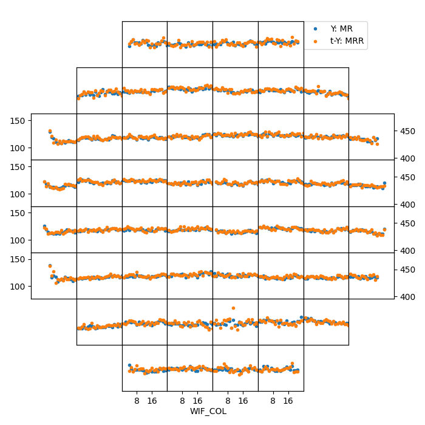

<!--
 DO NOT EDIT.
 THIS FILE WAS AUTOMATICALLY GENERATED BY mkdocs-gallery.
 TO MAKE CHANGES, EDIT THE SOURCE PYTHON FILE:
 "docs/examples/plot_7_twin_trends.py"
 LINE NUMBERS ARE GIVEN BELOW.
-->

!!! note

    Click [here](#download_links)
    to download the full example code


TwinY Trends `twin_trends`
=================================
> Wafer Trend Charts by Flash Field with Dual Y-axis

Have the advantage of double Y-axis, we're able to put two very different variables into same subplot for comparison. Take below chart for example, there's ~200ohm gap between `MR` &  `MRR`, yet two variables have similar sigma. You can find that `MR` basically overlaps with  `MRR`, the correlation between `MR` &  `MRR could be easily deduced from this chart.

<!-- GENERATED FROM PYTHON SOURCE LINES 9-21 -->

```{.python }

from wfmap.data import load_data
from wfmap import twin_trends
import scipy.stats.distributions as dist

data = load_data().query('80<MR<180')
norm = dist.norm_gen()
data['MRR'] = 200 + data['MR'] + \
    norm.rvs(data['MR'].median(), data['MR'].std(), size=len(data['MR']))

fig = twin_trends(data, 'MR', 'MRR')

```


{: .mkd-glr-single-img srcset="../images/mkd_glr_plot_7_twin_trends_001.png"}


<!-- GENERATED FROM PYTHON SOURCE LINES 22-26 -->

```{.python }

# When two variables not only have very different mean, the sigma is also not at the same level. The scale could no longer keep the same for Y & 2nd-Y axis, then need to adjust it as `fix_scale=False`.

fig2 = twin_trends(data, 'MR', 'HDI', fix_scale=False)
```


{: .mkd-glr-single-img srcset="../images/mkd_glr_plot_7_twin_trends_002.png"}


**Total running time of the script:** ( 0 minutes  2.916 seconds)

<div id="download_links"></div>


[:fontawesome-solid-download: Download Python source code: plot_7_twin_trends.py](./plot_7_twin_trends.py){ .md-button .center}

[:fontawesome-solid-download: Download Jupyter notebook: plot_7_twin_trends.ipynb](./plot_7_twin_trends.ipynb){ .md-button .center}


[Gallery generated by mkdocs-gallery](https://mkdocs-gallery.github.io){: .mkd-glr-signature }
