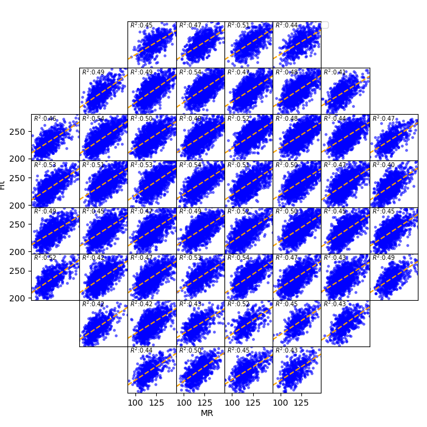
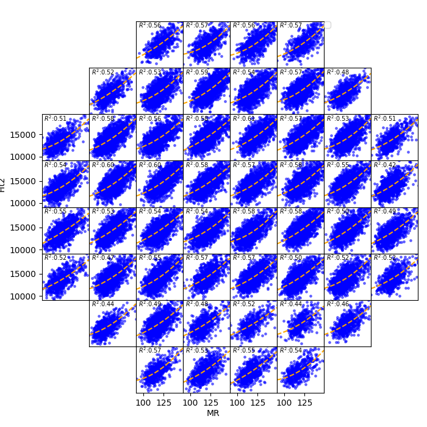

<!--
 DO NOT EDIT.
 THIS FILE WAS AUTOMATICALLY GENERATED BY mkdocs-gallery.
 TO MAKE CHANGES, EDIT THE SOURCE PYTHON FILE:
 "docs/examples/plot_8_wif_corrplot.py"
 LINE NUMBERS ARE GIVEN BELOW.
-->

!!! note

    Click [here](#download_links)
    to download the full example code


WIF Corrrelation Plot `wif_corrplot`
=================================
> Corrrelation Plot by Flash Field Between Two Variables

`wif_corrplot` is created to further investigate relationship between two variables. Beside the basic scatterplot, regression fitting line and R_squared annotation are both included.

<!-- GENERATED FROM PYTHON SOURCE LINES 9-20 -->

```{.python }

from wfmap.data import load_data
from wfmap import wif_corrplot
import scipy.stats.distributions as dist

data = load_data().query('80<MR<180')
norm = dist.norm_gen()

data['Fit'] = data['MR'] + \
    norm.rvs(data['MR'].median(), data['MR'].std(), size=len(data['MR']))
fig = wif_corrplot(data, 'MR', 'Fit')
```


{: .mkd-glr-single-img srcset="../images/mkd_glr_plot_8_wif_corrplot_001.png"}


<!-- GENERATED FROM PYTHON SOURCE LINES 21-22 -->

Linear regression is applied by default, while polynomial fit is also supported, modify the `fit_deg` to see the outcome.

<!-- GENERATED FROM PYTHON SOURCE LINES 22-27 -->

```{.python }


data['Fit2'] = (data['MR']-data['MR'].median())**2 + data['MR'] * \
    norm.rvs(data['MR'].median(), data['MR'].std(), size=len(data['MR']))
fig2 = wif_corrplot(data, 'MR', 'Fit2', fit_deg=2)
```


{: .mkd-glr-single-img srcset="../images/mkd_glr_plot_8_wif_corrplot_002.png"}


**Total running time of the script:** ( 0 minutes  5.227 seconds)

<div id="download_links"></div>


[:fontawesome-solid-download: Download Python source code: plot_8_wif_corrplot.py](./plot_8_wif_corrplot.py){ .md-button .center}

[:fontawesome-solid-download: Download Jupyter notebook: plot_8_wif_corrplot.ipynb](./plot_8_wif_corrplot.ipynb){ .md-button .center}


[Gallery generated by mkdocs-gallery](https://mkdocs-gallery.github.io){: .mkd-glr-signature }
