# WaferViz

`WaferViz` is a small GUI tool which wraps  `wfmap` to create fancy Wafer Map/Trend Plots.
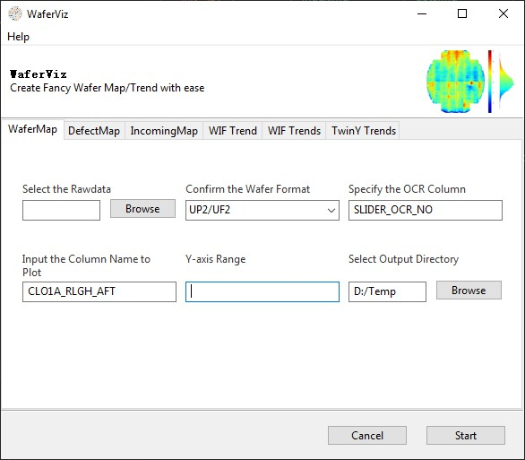

## Installation

Launch the application from command line as below:
```bash
git clone https://github.com/xlhaw/wfmap.git
cd wfmap/gui
pip install -r requirements.txt
python main.py
```

Since the package size by `Pyinstaller` is huge, the pre-compiled binary is not uploaded. Plan to rewrite with other approaches, eg **Tauri/Pyodide/Quarto** to package & distribute it in the future. 

## Configuration

Default settings are saved in the `config.yml` file, open with any text editor if need modification.
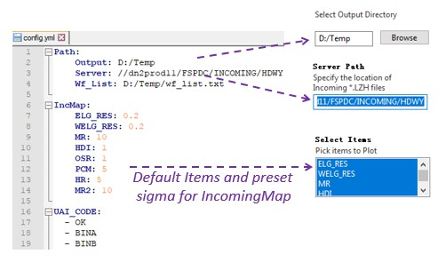

## Basic Usage

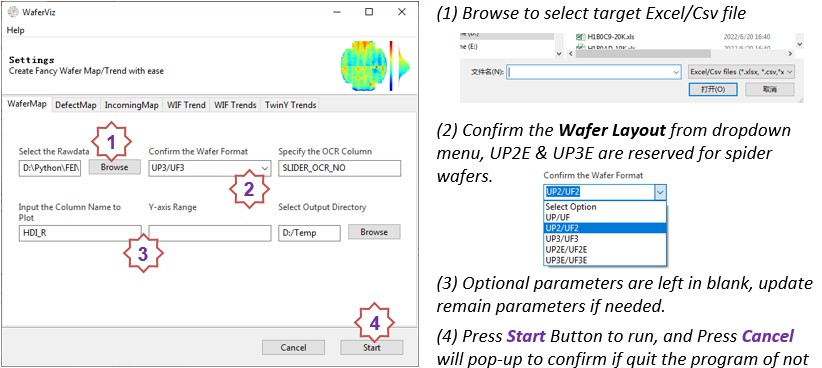
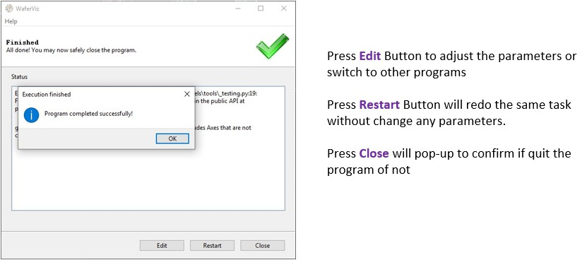

## Data Download
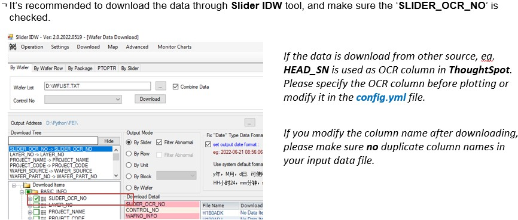

## WaferMap
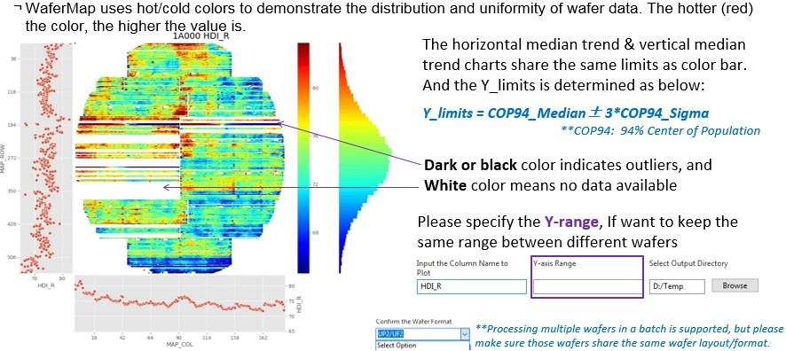

## DefectMap
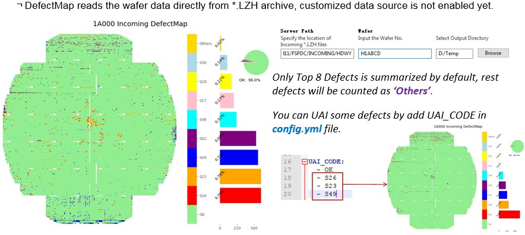

## IncomingMap
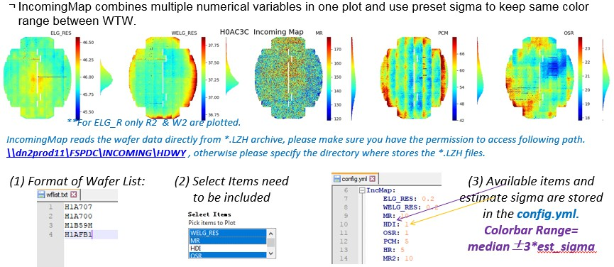

## WIF Trend
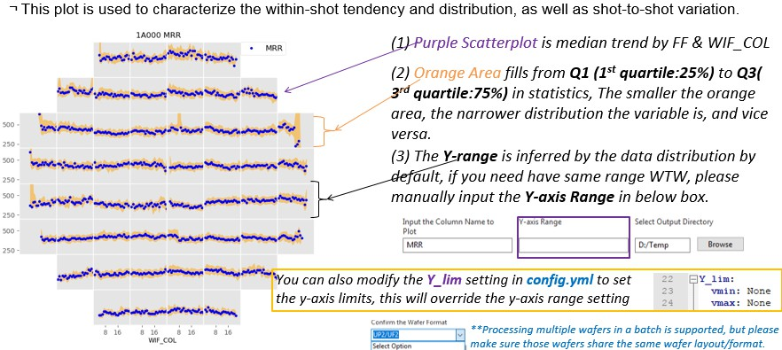

## WIF Trends
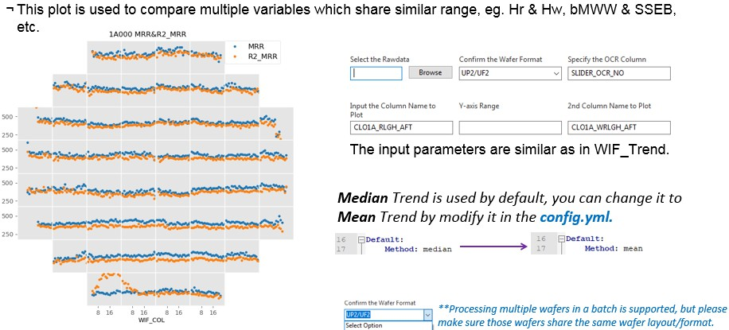

## TwinY Trends
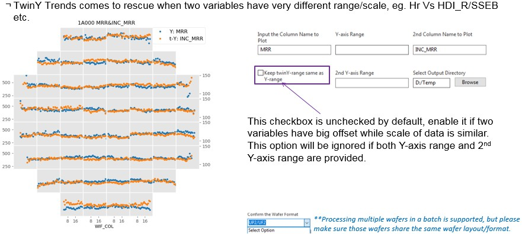