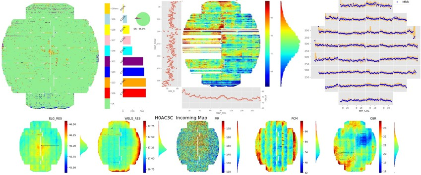

# Welcome to <font color='purple'>wfmap</font> Documentation


## Introduction

`wfmap` helps you understand wafer process data better, by presenting the data with heatmap and trend charts by flash field/shot. You can identify abnormal patterns intuitively in a global perspective and make it easier to compare and find potential correlation betweens different wafer parameters.



This documentation provides comprehensive introduction from [Data Preparation](https://wfmap.ml/data) to [Various Examples](https://wfmap.ml/generated/gallery). [Example Gallery](https://wfmap.ml/generated/gallery) introduces you to the ability to use the APIs of `wfmap` with the demo data enclosed. You can dive it deeper by reading the [API Reference](https://wfmap.ml/docstrings) or even the [source code](https://github.com/xlhaw/wfmap). A GUI application [WaferViz](https://wfmap.ml/gui) is also provided for non-technical users.

Let's roll!

## Installation

It's recommended to install _**wfmap**_ via PyPI using pip:

```bash
pip install wfmap
```

or build the latest build from Github:

```bash
git clone https://github.com/xlhaw/wfmap.git
cd wfmap
python setup.py install
```

A GUI application built with `Gooey` is also shipped together, you can launch it from command line:
```bash
git clone https://github.com/xlhaw/wfmap.git
cd wfmap/gui
pip install -r requirements.txt
python main.py
```
Please read the [WaferViz](https://wfmap.ml/gui) for more details.

## Example Gallery

[Gallery](https://wfmap.ml/generated/gallery) contains various examples from basic heatmap to highly customized wafer map & trend charts, it is a good start to learn the basic usage of this package. The examples & images were all generated by `mkdocs-gallery`.

</img></img>  </img> </img> 
</img> 


## Contributing